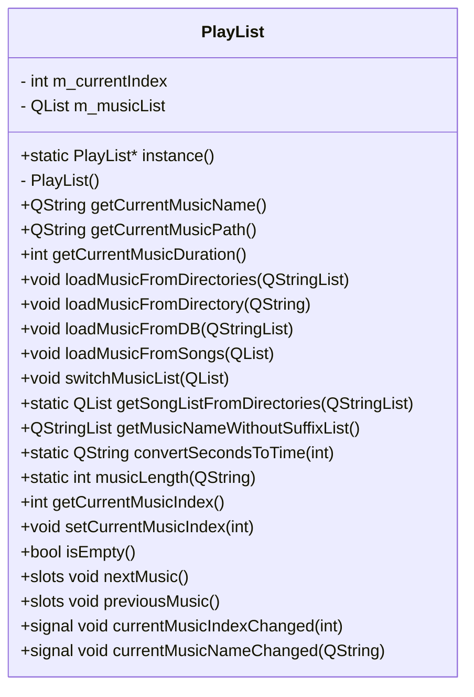

### UML Graph

```mermaid
classDiagram
class PlayList {
+static PlayList* instance()
- PlayList()
- int m_currentIndex
- QList<Song> m_musicList
+QString getCurrentMusicName()
+QString getCurrentMusicPath()
+int getCurrentMusicDuration()
+void loadMusicFromDirectories(QStringList)
+void loadMusicFromDirectory(QString)
+void loadMusicFromDB(QStringList)
+void loadMusicFromSongs(QList<Song>)
+void switchMusicList(QList<Song>)
+static QList<Song> getSongListFromDirectories(QStringList)
+QStringList getMusicNameWithoutSuffixList()
+static QString convertSecondsToTime(int)
+static int musicLength(QString)
+int getCurrentMusicIndex()
+void setCurrentMusicIndex(int)
+bool isEmpty()
+slots void nextMusic()
+slots void previousMusic()
+signal void currentMusicIndexChanged(int)
+signal void currentMusicNameChanged(QString)
}

```